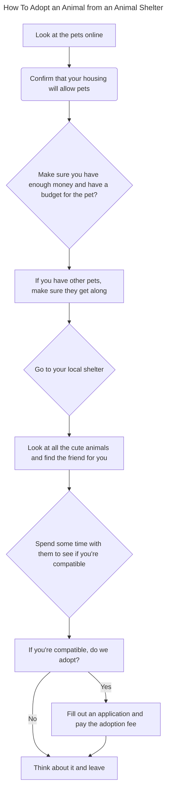

This flow chart describes the process of how to adopt an animal from the shelter.  

*A* You'll start by looking at pets online  
*B* Next, confirm that your housing will allow pets  
*C* You'll also want to make sure you have enough money to adopt the pet and have a budget for them (food, vet, training).  
*D* Make sure they get along with your other pets  
*E* Go to the local shelter  
*F* Look at all the animals and find one that's compatible for you  
*G* Spend some time with them  
*H* If you're compatible, do we adopt?   
*I* Yes, fill out an application and pay the adoption fee.   
*J* No, think about it and leave.

